# Glide-HIMS Entity Relationship Diagram

> 132 entities · 15,137 LOC · PostgreSQL · TypeORM · Multi-tenant

---

## Master ER Diagram (Mermaid)

```mermaid
erDiagram
    %% ═══════════════════════════════════════════
    %% CORE: Tenancy, Facilities, Users, Roles
    %% ═══════════════════════════════════════════

    Tenant ||--o{ Facility : "has"
    Tenant ||--o{ User : "has"
    Tenant ||--o{ SystemSetting : "has"

    Facility ||--o{ Department : "contains"
    Facility ||--o{ Ward : "contains"
    Facility ||--o{ Store : "contains"
    Facility ||--o{ BillingPoint : "contains"
    Facility }o--o| Facility : "parent"

    User ||--o{ UserRole : "assigned"
    Role ||--o{ UserRole : "grants"
    Role }o--o| Role : "inherits from"
    Facility |o--o{ UserRole : "scoped to"

    Role ||--o{ RolePermission : "has"
    Permission ||--o{ RolePermission : "granted via"
    Role ||--o{ RolePermissionGroup : "linked to"
    PermissionGroup ||--o{ RolePermissionGroup : "assigned via"
    PermissionGroup ||--o{ GroupPermission : "contains"
    Permission ||--o{ GroupPermission : "member of"
    User ||--o{ UserPermission : "direct grant"
    Permission ||--o{ UserPermission : "granted via"

    Department }o--o| Department : "parent"
    Department }o--|| Facility : "belongs to"
    User }o--o| Facility : "assigned to"
    User }o--o| Department : "works in"

    %% ═══════════════════════════════════════════
    %% CLINICAL: Patients, Encounters, Records
    %% ═══════════════════════════════════════════

    Patient }o--o| User : "linked to"
    Patient ||--o{ Encounter : "visits"
    Patient ||--o{ InsurancePolicy : "covered by"
    Patient ||--o{ PatientDocument : "documents"
    Patient ||--o{ PatientProblem : "problems"
    Patient ||--o{ PatientChronicCondition : "chronic"
    Patient ||--o{ PatientNote : "notes"
    Patient ||--o{ PatientReminder : "reminders"

    Encounter ||--o{ Vital : "vitals recorded"
    Encounter ||--o{ ClinicalNote : "notes written"
    Encounter ||--o{ Prescription : "prescribed"
    Encounter ||--o{ Order : "ordered"
    Encounter ||--o{ Invoice : "billed"
    Encounter ||--o{ Queue : "queued in"
    Encounter }o--|| Patient : "for"
    Encounter }o--|| Facility : "at"
    Encounter }o--o| Department : "in"
    Encounter }o--o| User : "attending provider"
    Encounter }o--|| User : "created by"
    Encounter }o--o| InsurancePolicy : "payer"

    Vital }o--|| Encounter : "from"
    Vital }o--|| User : "recorded by"

    ClinicalNote }o--|| Encounter : "from"
    ClinicalNote }o--|| User : "provider"

    Diagnosis ||--o{ PatientProblem : "classifies"
    Diagnosis ||--o{ PatientChronicCondition : "classifies"

    %% ═══════════════════════════════════════════
    %% PRESCRIPTIONS & PHARMACY
    %% ═══════════════════════════════════════════

    Prescription }o--|| Encounter : "from"
    Prescription }o--|| User : "prescribed by"
    Prescription ||--o{ PrescriptionItem : "contains"

    PrescriptionItem }o--|| Prescription : "belongs to"
    PrescriptionItem ||--o{ Dispensation : "dispensed via"
    PrescriptionItem ||--o{ MedicationAdministration : "administered"
    PrescriptionItem ||--o{ MedicationAdherenceRecord : "adherence"
    PrescriptionItem ||--o{ ControlledSubstanceLog : "controlled log"

    Dispensation }o--|| PrescriptionItem : "for"
    Dispensation }o--|| User : "dispensed by"

    PharmacySale }o--o| Store : "from"
    PharmacySale }o--o| Patient : "to"
    PharmacySale }o--|| User : "sold by"
    PharmacySale ||--o{ PharmacySaleItem : "items"

    %% ═══════════════════════════════════════════
    %% ORDERS, LAB, RADIOLOGY
    %% ═══════════════════════════════════════════

    Order }o--|| Encounter : "from"
    Order }o--|| User : "ordered by"
    Order ||--o{ LabSample : "samples"

    LabTest ||--o{ LabSample : "tested via"
    LabSample }o--|| Order : "for order"
    LabSample }o--|| Patient : "patient"
    LabSample }o--|| LabTest : "test type"
    LabSample ||--o{ LabResult : "results"

    LabResult }o--|| LabSample : "from"
    LabResult }o--o| User : "entered by"
    LabResult }o--o| User : "validated by"

    ImagingOrder }o--|| Patient : "for"
    ImagingOrder }o--|| Encounter : "from"
    ImagingOrder }o--|| ImagingModality : "modality"
    ImagingOrder ||--o| ImagingResult : "result"

    %% ═══════════════════════════════════════════
    %% BILLING & FINANCE
    %% ═══════════════════════════════════════════

    Invoice }o--|| Patient : "billed to"
    Invoice }o--o| Encounter : "for visit"
    Invoice }o--|| User : "created by"
    Invoice ||--o{ InvoiceItem : "line items"
    Invoice ||--o{ Payment : "payments"

    Payment }o--|| Invoice : "against"
    Payment }o--|| User : "received by"

    ChartOfAccount }o--o| ChartOfAccount : "parent"
    ChartOfAccount ||--o{ JournalEntryLine : "entries"

    JournalEntry }o--|| FiscalPeriod : "period"
    JournalEntry ||--o{ JournalEntryLine : "lines"
    JournalEntryLine }o--|| ChartOfAccount : "account"

    Budget ||--o{ BudgetLine : "lines"
    BudgetLine }o--|| ChartOfAccount : "account"

    %% ═══════════════════════════════════════════
    %% INSURANCE
    %% ═══════════════════════════════════════════

    InsuranceProvider ||--o{ InsurancePolicy : "provides"
    InsuranceProvider ||--o{ InsuranceClaim : "claims against"

    InsurancePolicy }o--|| InsuranceProvider : "from"
    InsurancePolicy }o--|| Patient : "covers"
    InsurancePolicy ||--o{ PreAuthorization : "pre-auths"

    InsuranceClaim }o--|| InsurancePolicy : "under"
    InsuranceClaim }o--|| Encounter : "for visit"
    InsuranceClaim ||--o{ ClaimItem : "items"

    %% ═══════════════════════════════════════════
    %% IPD: Wards, Beds, Admissions
    %% ═══════════════════════════════════════════

    Ward }o--|| Facility : "in"
    Ward ||--o{ Bed : "contains"
    Ward ||--o{ Admission : "admissions"

    Bed }o--|| Ward : "in"
    Bed ||--o{ Admission : "occupancies"

    Admission }o--|| Patient : "patient"
    Admission }o--|| Encounter : "encounter"
    Admission }o--|| Ward : "ward"
    Admission }o--|| Bed : "bed"
    Admission }o--|| User : "admitted by"
    Admission ||--o{ NursingNote : "notes"
    Admission ||--o{ MedicationAdministration : "meds"
    Admission ||--o{ BedTransfer : "transfers"

    BedTransfer }o--|| Admission : "for"
    BedTransfer }o--|| Ward : "from ward"
    BedTransfer }o--|| Ward : "to ward"

    %% ═══════════════════════════════════════════
    %% SURGERY & EMERGENCY
    %% ═══════════════════════════════════════════

    SurgeryCase }o--|| Patient : "patient"
    SurgeryCase }o--|| Encounter : "encounter"
    SurgeryCase }o--|| Theatre : "theatre"
    SurgeryCase ||--o{ SurgeryConsumable : "consumables"
    SurgeryConsumable }o--|| Item : "item used"

    EmergencyCase }o--|| Encounter : "encounter"
    EmergencyCase }o--o| User : "triage nurse"
    EmergencyCase }o--o| User : "attending doctor"

    %% ═══════════════════════════════════════════
    %% MATERNITY
    %% ═══════════════════════════════════════════

    AntenatalRegistration }o--|| Patient : "mother"
    AntenatalRegistration ||--o{ AntenatalVisit : "visits"
    AntenatalRegistration ||--o{ LabourRecord : "labours"
    AntenatalRegistration ||--o{ PostnatalVisit : "postnatal"

    LabourRecord ||--o{ DeliveryOutcome : "outcomes"
    DeliveryOutcome ||--o{ BabyWellnessCheck : "baby checks"
    DeliveryOutcome ||--o{ ImmunizationSchedule : "immunizations"
    PostnatalVisit }o--o| DeliveryOutcome : "related to"

    %% ═══════════════════════════════════════════
    %% INVENTORY & SUPPLY CHAIN
    %% ═══════════════════════════════════════════

    Item ||--o{ StockBalance : "stock at"
    Item ||--o{ StockLedger : "movements"
    Item ||--o{ BatchStockBalance : "batches"
    Item ||--o{ ExpiryAlert : "alerts"
    Item ||--o{ DisposalRecord : "disposals"
    Item }o--o| ItemCategory : "category"

    Store }o--|| Facility : "in"
    Store }o--o| Department : "department"
    StockBalance }o--|| Item : "item"
    StockBalance }o--|| Facility : "facility"
    StockBalance }o--o| Store : "store"

    StockTransfer }o--|| Store : "from"
    StockTransfer }o--|| Store : "to"
    StockTransfer ||--o{ StockTransferItem : "items"

    %% ═══════════════════════════════════════════
    %% PROCUREMENT
    %% ═══════════════════════════════════════════

    Supplier ||--o{ PurchaseOrder : "orders from"
    Supplier ||--o{ VendorContract : "contracts with"
    Supplier ||--o{ VendorRating : "rated"

    PurchaseOrder }o--|| Supplier : "supplier"
    PurchaseOrder }o--|| Facility : "facility"
    PurchaseOrder ||--o{ PurchaseOrderItem : "items"

    RFQ }o--|| Facility : "facility"
    RFQ ||--o{ RFQItem : "items"
    RFQ ||--o{ RFQVendor : "vendors"
    RFQ ||--o{ VendorQuotation : "quotations"
    RFQVendor }o--|| Supplier : "supplier"
    VendorQuotation }o--|| Supplier : "from"
    VendorQuotation ||--o{ VendorQuotationItem : "items"

    PriceAgreement }o--|| Supplier : "with"

    %% ═══════════════════════════════════════════
    %% HR & PAYROLL
    %% ═══════════════════════════════════════════

    Employee }o--o| User : "linked to"
    Employee }o--|| Facility : "works at"
    Employee ||--o{ Payslip : "payslips"
    Employee ||--o{ LeaveRequest : "leave"
    Employee ||--o{ AttendanceRecord : "attendance"
    Employee ||--o{ StaffRoster : "roster"

    PayrollRun ||--o{ Payslip : "payslips"
    Payslip }o--|| Employee : "employee"
    Payslip }o--|| PayrollRun : "run"

    Provider |o--o| User : "linked to"
    Provider }o--|| Facility : "at"
    Provider }o--o| Department : "in"

    DoctorDuty }o--|| User : "doctor"
    DoctorDuty }o--|| Facility : "at"
    DoctorDuty }o--o| Department : "in"

    ShiftDefinition }o--|| Facility : "at"
    StaffRoster }o--|| Employee : "employee"
    StaffRoster }o--|| ShiftDefinition : "shift"

    %% ═══════════════════════════════════════════
    %% CLINICAL WORKFLOW
    %% ═══════════════════════════════════════════

    Referral }o--|| Patient : "patient"
    Referral }o--|| Encounter : "from encounter"
    Referral }o--o| Facility : "from facility"
    Referral }o--o| Facility : "to facility"

    TreatmentPlan }o--|| Patient : "for"
    TreatmentPlan }o--|| Encounter : "from"

    FollowUp }o--|| Patient : "for"
    FollowUp }o--|| Encounter : "source"

    DischargeSummary }o--|| Patient : "for"
    DischargeSummary }o--|| Encounter : "from"

    %% ═══════════════════════════════════════════
    %% SYSTEM & SYNC
    %% ═══════════════════════════════════════════

    AuditLog }o--|| User : "by"
    SyncQueue }o--|| Facility : "facility"
    SyncQueue }o--|| User : "user"
    SyncConflict }o--|| Facility : "facility"
    InAppNotification }o--|| User : "target"
    BiometricData }o--|| User : "for"
    FacilityConfig }o--|| Facility : "for"
    FacilityModule }o--|| Facility : "for"
```



---

## Domain Cluster Diagram

### 1. CORE IDENTITY (Tenant → Facility → User → Role)

```
┌─────────┐     ┌───────────┐     ┌──────┐     ┌──────┐
│ Tenant  │1───*│ Facility  │1───*│ User │*───*│ Role │
└─────────┘     └───────────┘     └──────┘     └──────┘
                  │ self-ref       │ UserRole    │ self-ref
                  │ parent_id      │ (scoped     │ parent_id
                  │                │  to facility│
                  ├──*Department   │  + dept)    ├──*RolePermission
                  ├──*Ward         │             ├──*RolePermissionGroup
                  ├──*Store        ├──*UserPerm  │
                  └──*BillingPoint └──*AuditLog  └──*PermissionGroup
                                                     └──*GroupPermission
                                                          └──Permission
```

### 2. CLINICAL CORE (Patient → Encounter → Records)

```
┌─────────┐     ┌───────────┐     ┌──────────────────────────────┐
│ Patient │1───*│ Encounter │1───*│ Vital                        │
│         │     │           │     │ ClinicalNote                 │
│         │     │           │     │ Prescription → Items → Disp. │
│         │     │           │     │ Order → LabSample → Result   │
│         │     │           │     │ Invoice → Items → Payment    │
│         │     │           │     │ Queue                        │
│         │     │           │     │ Admission → NursingNote       │
│         │     │           │     │              BedTransfer      │
│         │     │           │     │              MedAdmin         │
│         │     │           │     │ Referral, TreatmentPlan      │
│         │     │           │     │ FollowUp, DischargeSummary   │
│         │     │           │     │ InsuranceClaim                │
│         │     │           │     │ EmergencyCase                 │
│         │     │           │     │ SurgeryCase → Consumables     │
│         │     │           │     │ ImagingOrder → ImagingResult  │
└─────────┘     └───────────┘     └──────────────────────────────┘
  │                                         
  ├──*InsurancePolicy                       
  ├──*PatientDocument                       
  ├──*PatientProblem ──→ Diagnosis          
  ├──*PatientChronicCondition ──→ Diagnosis 
  ├──*PatientNote                           
  ├──*PatientReminder                       
  ├──*AntenatalRegistration                 
  └──*PharmacySale                          
```

### 3. INVENTORY & SUPPLY CHAIN

```
┌──────┐     ┌──────────────┐     ┌──────────────────┐
│ Item │1───*│ StockBalance │     │ Supplier         │
│      │     │ StockLedger  │     │  ├──*PurchaseOrder│
│      │     │ BatchStock   │     │  ├──*VendorContract│
│      │     │ ExpiryAlert  │     │  ├──*VendorRating │
│      │     │ DisposalRec  │     │  ├──*PriceAgmt   │
│      │     └──────────────┘     │  └──*RFQVendor   │
│      │                          └──────────────────┘
│      │     ┌──────────────┐
│      │     │ Store        │ ←── StockTransfer (from ↔ to)
│      │     │  └──*Balance │      └──*TransferItem
└──────┘     └──────────────┘
  │
  ├── ItemCategory, ItemSubcategory, ItemBrand
  ├── ItemFormulation, ItemUnit, StorageCondition
  └── DrugClassification, ControlledSubstanceLog
```

### 4. MATERNITY CHAIN

```
Patient → AntenatalRegistration → AntenatalVisit
                                → LabourRecord → DeliveryOutcome → BabyWellnessCheck
                                                                 → ImmunizationSchedule
                                → PostnatalVisit
```

### 5. HR & PAYROLL

```
Employee → User (optional link)
  ├──*Payslip ←── PayrollRun
  ├──*LeaveRequest
  ├──*AttendanceRecord
  ├──*StaffRoster ←── ShiftDefinition
  └──*StaffDocument

Provider ←→ User (1:1)
DoctorDuty → User + Facility + Department
```

### 6. FINANCE

```
ChartOfAccount (tree) ←── JournalEntryLine ←── JournalEntry ←── FiscalPeriod
                      ←── BudgetLine ←── Budget
BankReconciliation → ChartOfAccount
PettyCashFund → PettyCashTransaction
```

---

## Relationship Statistics

| Relationship Type | Count |
|-------------------|-------|
| ManyToOne (FK)    | ~220  |
| OneToMany         | ~85   |
| OneToOne          | 2 (Provider↔User, ImagingResult↔ImagingOrder) |
| Self-referencing  | 4 (Facility, Department, Role, ChartOfAccount) |
| Cascade deletes   | 8 (UserPermission, GroupPermission, RolePermissionGroup, BiometricData, InAppNotification, etc.) |

## Most Connected Entities

| Entity     | Inbound FKs | Outbound FKs | Total |
|------------|-------------|--------------|-------|
| **User**   | 82          | 3            | 85    |
| **Facility**| 75         | 2            | 77    |
| **Patient** | 20         | 1            | 21    |
| **Encounter**| 18        | 6            | 24    |
| **Item**   | 12          | 6            | 18    |
| **Supplier**| 12         | 1            | 13    |
| **Store**  | 8           | 3            | 11    |

## BaseEntity (All 132 Entities Inherit)

```sql
-- Every table has these columns:
id          UUID PRIMARY KEY DEFAULT gen_random_uuid()
tenant_id   UUID NULLABLE INDEX          -- multi-tenant isolation
created_at  TIMESTAMPTZ DEFAULT now()
updated_at  TIMESTAMPTZ DEFAULT now()
deleted_at  TIMESTAMPTZ NULLABLE         -- soft delete
```
